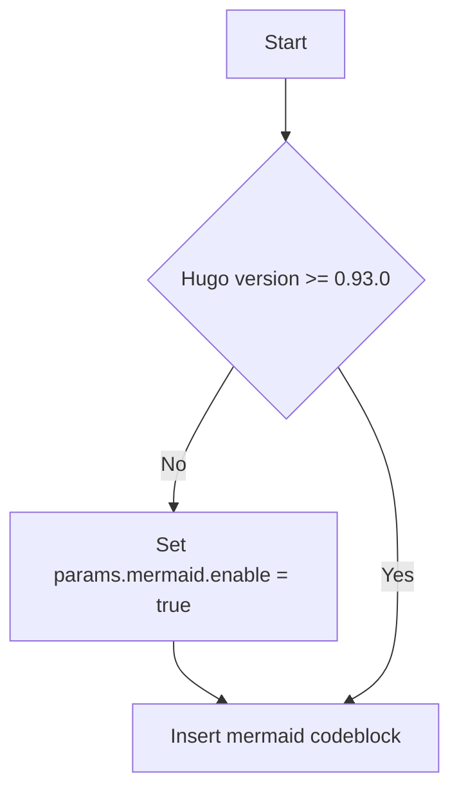

<!--
---
title: Mermaid Diagram Samples
description: Mermaid
---
-->

```mermaid
graph TD
  Start --> Need{"Hugo version >= 0.93.0"}
  Need -- No --> Off["Set params.mermaid.enable = true"]
  Off --> Author
  Need -- Yes --> Author[Insert mermaid codeblock]
```
